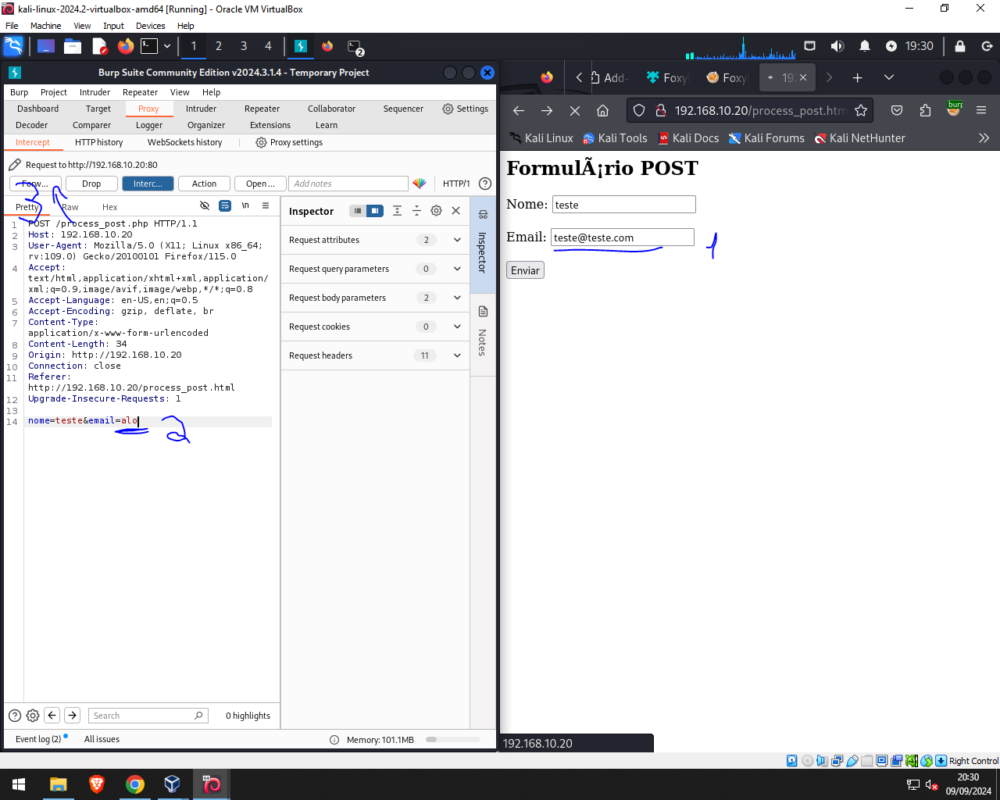

# POST e Burp Suite e Proxy

PortSwigger -> Referência em vulnerabilidades de aplicações

1. Abra a ferramenta Burp Suite no Kali
2. Ir no Mozilla Firefox e pesquisar pela settings de Proxy
3. Configure um Proxy Manual HTTP com o IP 127.0.0.1 na porta 8080.
    * Isso vai fazer com que tudo passe pelo IP 127.0.0.1 na porta 8080. Mas aí para cada coisa nova precisaríamos configurar dnv
4. Ao invés disso, pesquisa pelas extensões do Mozilla por Foxyproxy, instalar e dar pin na barra de tarefas
5. Clique na extensão e aperte em Options
6. Vá na aba Proxies 
7. Ligue o proxy burp
8. Vá no Burp Suite e vá na aba Proxy
7. 
8. 
9. Perceba que os dados do Body apareceram todos no Burp Suit, o famoso **Man in The Middle**
10. Esse ataque só funciona UMA VEZ, ou seja, é bom sempre errar a primeira vez
11. Depois podemos apertar em "Forward" para liberar o site para o cliente que foi capturado
12. 
13. 