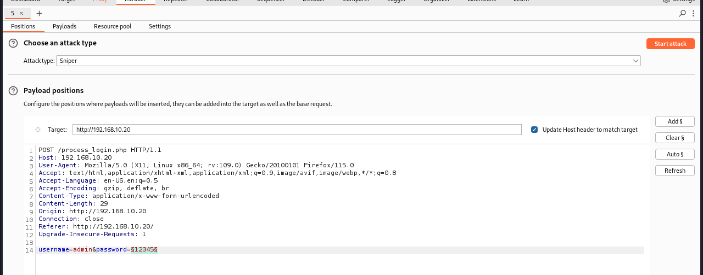
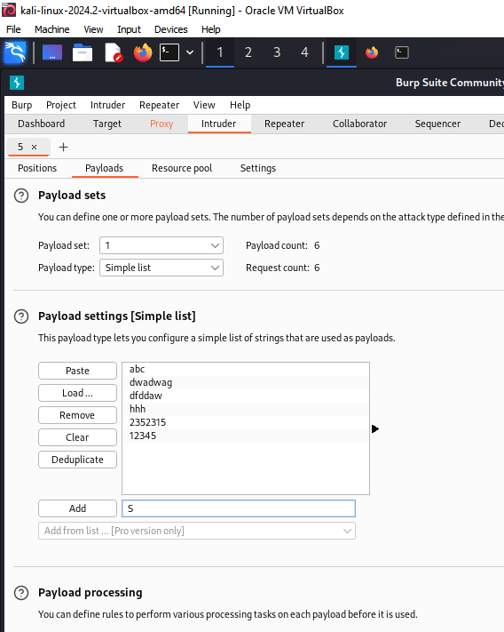
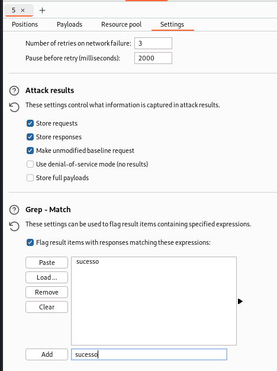
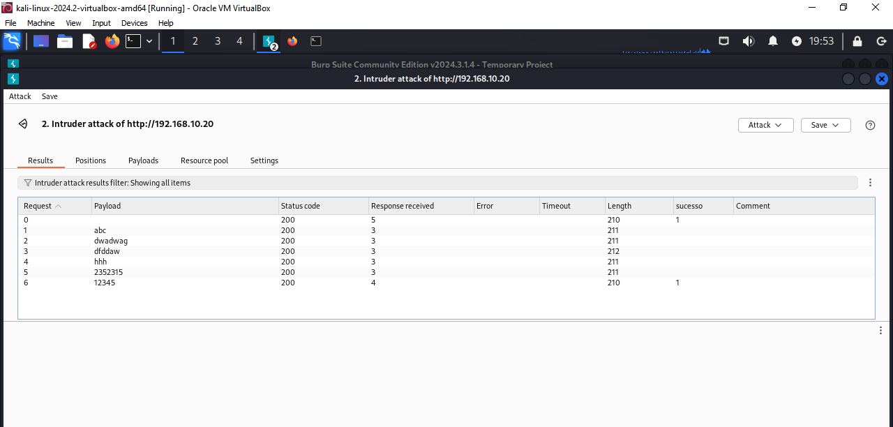

# Ataque força bruta em um formulário WEB
Lembrando que vamos começar iniciando o Foxyproxy e iniciando o Intercept do Burp.  
1. Interceptar envio de formulário POST
2. No Burp, clicamos com o direito e vamos em Ir para Intruder
3. Podemos configurar o ataque Sniper ou Cluster Bomb.
    * Sniper descobre a senha ou usuário
    * Cluester Bomb descobre os dois
4. Apertamos em "Clear"
5. Selecionamos o texto que queremos descobrir da requisição na primeira aba do Intruder
6. Apertamos em Add
    - 
7. Adicionamos várias senhas como payload manualmente - Simple List Payload
    - 
8. Vamos em Settings e removemos tudo que está em Grep Match. Ele por padrão vai tentar encontrar tudo via grep, mas não queremos isso.
9. Ao invés, vamos colocar apenas a mensagem de login com sucesso.
    - 
10. No final iniciamos o ataque.
    - 