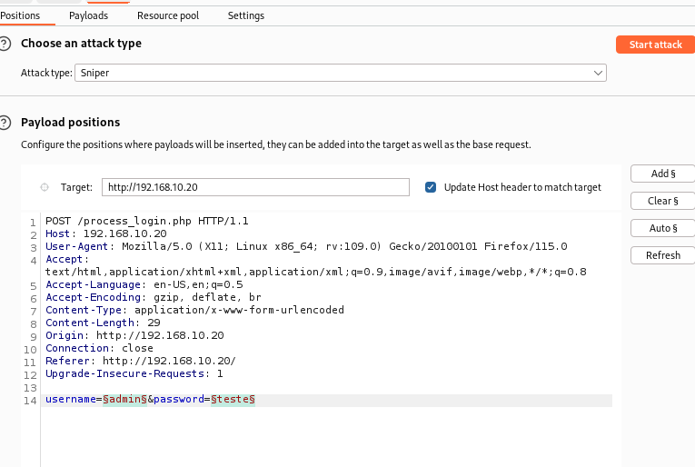
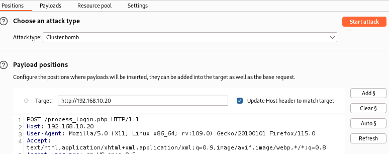
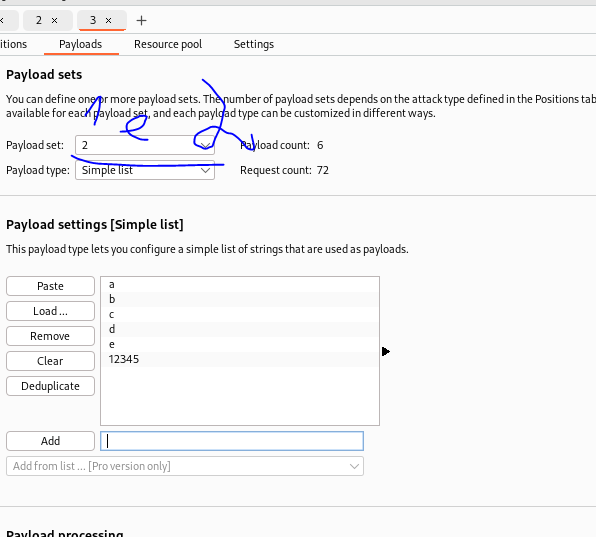
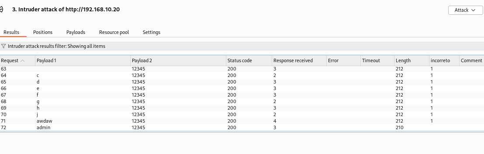
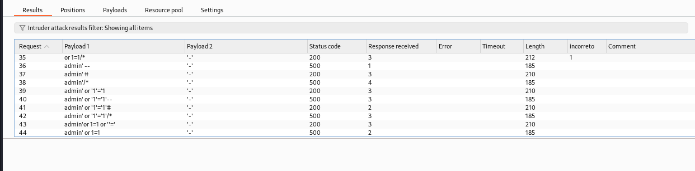

# Usando Burp e Intruder com usuário e senha

1. A diferença é que vamos adicionar como variáveis de Intruder tanto o campo de login quanto de senha.
2. Configurando variáveis
    * 
3. Selecionar ataque Cluster Bomb
    * 
4. Configurando payloads 1 e 2 (login e senha)
    * 
5. Não esquecer de configurar o Grep Match
6. Resultado
    * 
7. Desafio: Fazer o mesmo com Hydra

# Ataque de SQL Injection
https://github.com/payloadbox/sql-injection-payload-list/tree/master/Intruder/exploit  
No site, em Auth_Bypass tem vários exemplos, na linha 124 por exemplo: ' or '1'='1  

1. A ideia é trocar os payloads de user e senha pelos payloads do site e testar um Cluster Bomb.
2. Perceba que vários vão passar.
3. Obs: O código precisar estar com a query usando concatenação:
    * `WHERE username='$user' AND password='$pass'`
4. Perceba o tanto de payload que vai passar:
    * 
5. SELECT * FROM users WHERE username='' OR '1'='1' AND password='' OR '1'='1';
    * Perceba que não sabemos a senha, mas logamos!
6. SELECT * FROM users WHERE username='' UNION SELECT 1, 2, database(); --'AND password = '';
